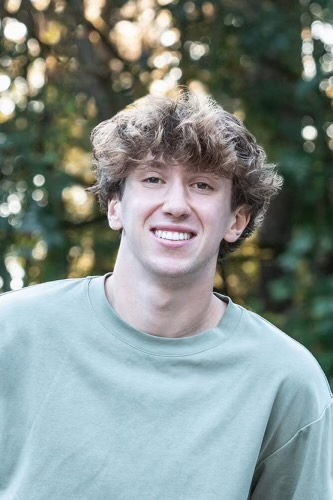

:::: {style="display: flex; gap: 2rem; align-items: flex-start; flex-wrap: wrap;"}

::: {style="flex: 0 0 220px;"}
{style="width: 220px; border-radius: 6px;"}
:::

::: {style="flex: 1; min-width: 280px;"}
I'm a first-year Statistics and Data Science major at the University of California, Los Angeles, planning to minor in Creative Writing. I graduated from Shorewood High School in 2025 and plan to finish my degree in four years.

I'm interested in the real-world implications of data in fields like environmental science, business practice, and the life sciences. The projects on this site reflect that. I'm hoping to find research or internship experience that combines quantitative work with real questions and actionable solutions.

When I'm not studying, I'm usually triathlon training, rock climbing, hiking, reading, or playing guitar. I'm also very involved in Christian ministries at UCLA.
:::

::::